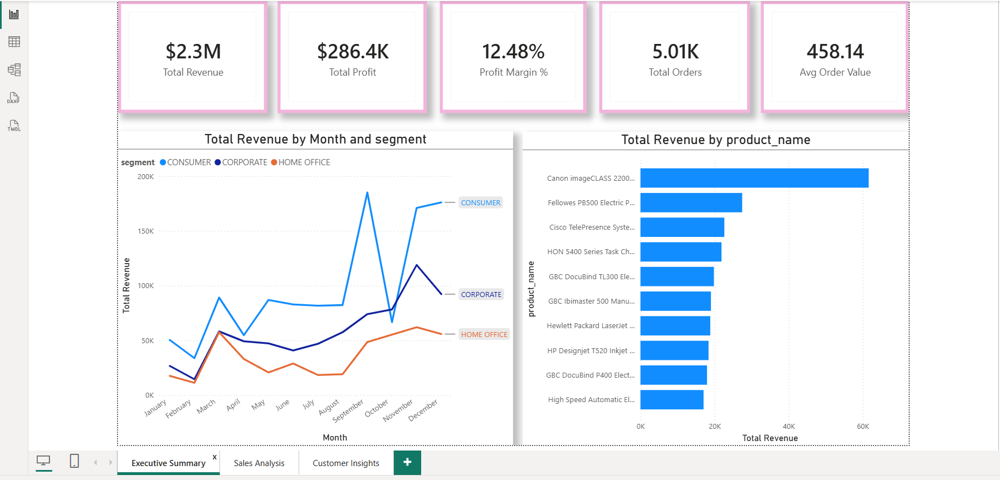
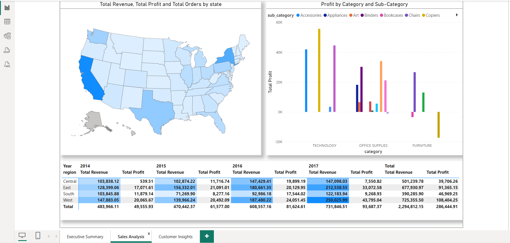
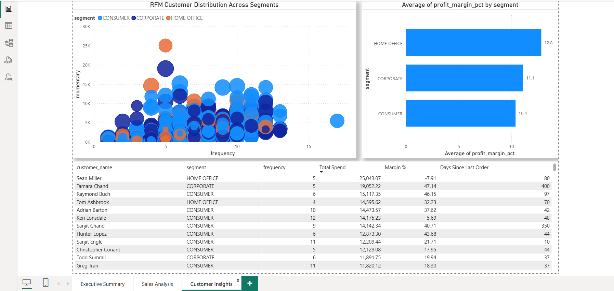

# Retail360 - Sales Analytics Dashboard
### End-to-End Power BI + SQL Server Project

## 📌 Project Summary
Cleaned and analyzed 9,994 retail transactions using SQL Server,
then built a 3-page interactive Power BI dashboard covering
executive KPIs, regional sales analysis, and customer segmentation.

## 🛠️ Tools Used
- SQL Server Management Studio 2022
- Power BI Desktop
- DAX
- GitHub

## 🧹 Data Cleaning (SQL)
- Removed duplicates using ROW_NUMBER() window function
- Handled NULL values in Sales, Profit, Postal_Code columns
- Standardized data types (dates, decimals, text casing)
- Built RFM (Recency, Frequency, Monetary) customer segmentation
  using CTEs and GROUP BY

## 📊 Dashboard Pages

### 1. Executive Summary
KPI cards for Revenue, Profit, Profit Margin %, Orders, and AOV,
plus monthly revenue trend by customer segment and top 10 products.

### 2. Sales Analysis
Filled map of revenue by US state, profit breakdown by category
and sub-category, and a Region × Year matrix with conditional
formatting heatmap.

### 3. Customer Insights
RFM scatter plot (Frequency vs Monetary, sized by profit margin),
profit margin comparison by customer segment, and a top 20
customers table.

## 🔑 Key Insights
- West region generates the highest revenue and profit
- Technology category has significantly higher profit margins
  than Furniture
- The "Tables" sub-category operates at a loss despite high sales
- Top 20% of customers contribute a large share of total revenue

## 📁 Repository Structure
- `sql_scripts/` - SQL cleaning, view creation, and analysis queries
- `Retail360.pbix` - Power BI dashboard file
- Screenshot PNGs - dashboard page exports

## 🚀 How to Use
1. Restore the Superstore dataset into SQL Server
2. Run scripts in `sql_scripts/` in numbered order
3. Open `Retail360.pbix` in Power BI Desktop
4. Update the SQL Server connection if prompted
